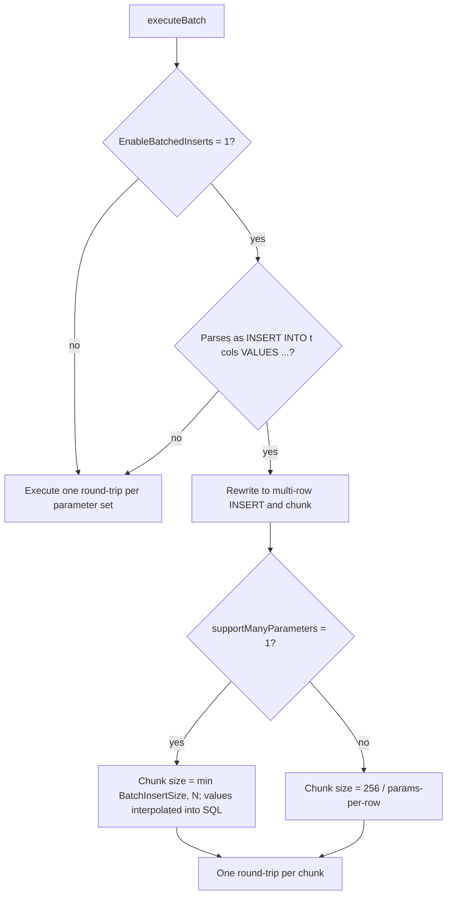
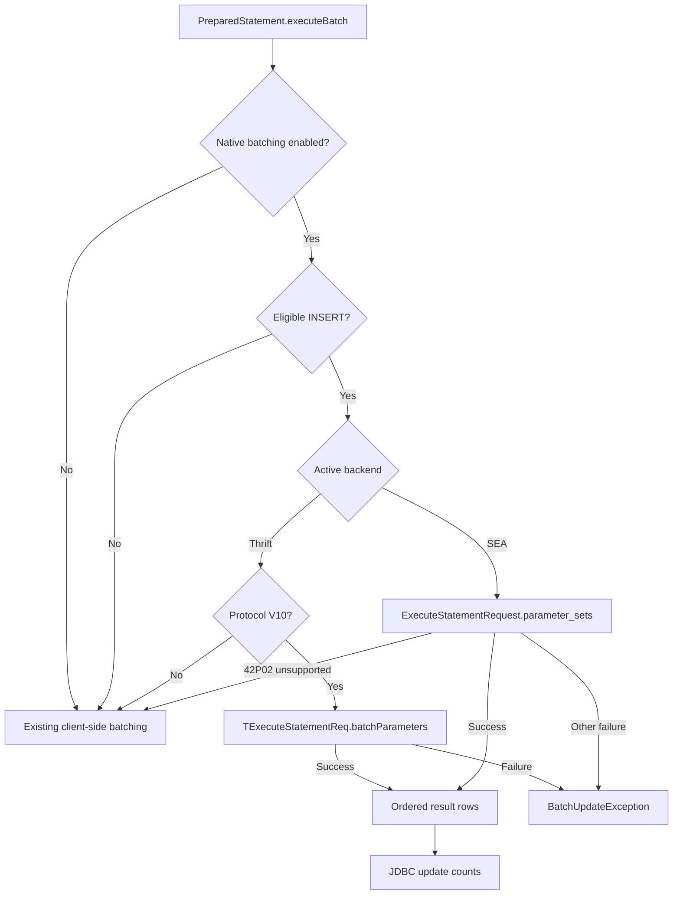

# Design doc: Batch Parameterized Inserts in the JDBC Driver

---

# Introduction

`PreparedStatement.executeBatch()` is the standard JDBC path for inserting many rows efficiently. Today the Databricks JDBC driver either executes one statement per parameter set or rewrites the parameter sets into chunked multi-row `INSERT` statements on the client.

This document describes the JDBC driver implementation for **native batch execution**: sending all parameter sets from `executeBatch()` in a single backend request using Thrift protocol V10 or SEA `parameter_sets`, while keeping the current client-side path as a compatibility fallback for older backends.

# Requirements

The scope is limited to the JDBC driver and its integration with the Thrift SQL gateway and SEA (Statement Execution API) batch support.

The driver implementation adheres to the following principles:

- **INSERT-only scope:** Only parameterized `INSERT` statements are eligible for native batching.
- **Single backend request:** When supported, all parameter sets travel in one request rather than N statements or N chunks.
- **Safe fallback:** When the backend does not support native batching, the driver uses the existing client-side path.
- **Connection control:** A connection flag controls whether native batching is used.
- **Predictable results:** On success, `executeBatch()` returns one ordered update count per parameter set. On atomic failure, it throws the standard JDBC `BatchUpdateException`, with `getUpdateCounts()` returning one `Statement.EXECUTE_FAILED` entry for every parameter set.
- **Backend limits:** The driver propagates backend limit errors (parameter count/size) without retrying or chunking.

## Out of Scope

- `UPDATE`, `DELETE`, `MERGE`, and other non-`INSERT` statements.
- `Statement.addBatch(String sql)` remains unchanged, and `PreparedStatement.addBatch(String sql)` remains unsupported; native batching applies only to `PreparedStatement.addBatch()`.
- Complex parameter types such as arrays, maps, and structs remain unsupported; the same limitation applies to current single-row parameterized inserts as well.
- Partial-success semantics within a single native request (native execution is treated as all-or-nothing).

# Current behavior

This section documents the current batch behavior retained as the compatibility fallback.

## Two batch paths

| Entry point                             | Handler                          | Behavior                                                                                                                                                                                                                                 |
| --------------------------------------- | -------------------------------- | ---------------------------------------------------------------------------------------------------------------------------------------------------------------------------------------------------------------------------------------- |
| `Statement.addBatch(String sql)`        | `DatabricksBatchExecutor`        | Executes each command **sequentially**, one server round-trip per command. Stops on the first failure or if a command returns a `ResultSet`, throwing `BatchUpdateException` with the counts gathered so far. Enforces a `maxBatchSize`. |
| `PreparedStatement.addBatch()` (no-arg) | `PreparedStatementBatchExecutor` | Stores each parameter set; `executeBatch()` either rewrites to a multi-row `INSERT` or replays per set (see below).                                                                                                                      |

`PreparedStatement.addBatch(String)` is unsupported and throws.

## PreparedStatement batch flow (today)

**Multi-row rewrite** (`InsertStatementParser`): a regex matches the strict form `INSERT INTO table (col1, ...) VALUES (...)`. If it matches, the driver generates a multi-row `INSERT ... VALUES (...), (...), ...` and executes it in chunks:

- **Parameterized (`supportManyParameters=0`, default):** chunk size = `256 / parameters_per_row` (backend cap `MAX_QUERY_PARAMETERS = 256`), at least 1 row per chunk.
- **Interpolated (`supportManyParameters=1`):** values are interpolated directly into the SQL string, so there is no 256-parameter cap; chunk size = `min(BatchInsertSize, N)`. The user must keep each chunk under the 16 MB statement limit.

Each chunk is one server round-trip. Update counts are assumed to be `1` per row.

**Fallback (individual execution):** if `EnableBatchedInserts=0`, or the SQL is not an eligible `INSERT`, or parsing fails, the driver replays the original SQL **once per parameter set**. Update counts come from each result.

## Relevant connection properties

| Property                | Default   | Effect                                                                              |
| ----------------------- | --------- | ----------------------------------------------------------------------------------- |
| `EnableBatchedInserts`  | `0` (off) | Enables the client-side multi-row `INSERT` rewrite.                                 |
| `BatchInsertSize`       | `1000`    | Max rows per chunk when interpolating (`supportManyParameters=1`).                  |
| `supportManyParameters` | `0`       | When set to `1`, interpolates parameters into SQL, bypassing the 256-parameter cap. |

## Current driver limitations

- **No single-request batch:** even the optimized path is chunked and issues multiple round-trips.
- **Client-side rewrite only:** limited to the strict `INSERT INTO t (cols) VALUES (...)` form; anything else falls back to per-set replay.
- **Parameter cap:** the parameterized path is capped at 256 parameters, forcing many chunks for large batches; the workaround (interpolation) sacrifices true parameterization and risks the 16 MB limit.
- **Partial-commit risk:** Client-side batching issues multiple requests. Without an explicit transaction, earlier successful requests may remain committed if a later request fails.
- **Update counts assumed `1`:** the batched path does not read real per-row affected counts.

# High-level design - Native batch flow

The backend returns one ordered result row per parameter set. The driver reads the affected-rows count and returns those values from `executeBatch()`.

# Thrift flow

## Protocol

- Add support for `SPARK_CLI_SERVICE_PROTOCOL_V10`.
- Singular `parameters` and `batchParameters` must never be sent together.

## Negotiation

During `OpenSession`, the driver advertises its maximum supported Spark CLI protocol; the server returns the negotiated version.

- **Negotiated V10:** native batch requests are allowed.
- **Negotiated V9 or older:** do not send `batchParameters`; use client-side batching.

# SEA flow

## Request

- Keep the existing driver-owned `ExecuteStatementRequest` POJO and add `parameter_sets`.
- Add a small driver-owned `StatementParameterSet` POJO; continue using the SDK's `StatementParameterListItem` for individual values.

The request is submitted through the existing SQL Statement Execution endpoint and reuses existing polling and result handling.

## Compatibility

SEA has no equivalent of Thrift `OpenSession` protocol negotiation. The driver sends `parameter_sets`; if an older backend does not support native batching and returns the documented `42P02 [UNBOUND_SQL_PARAMETER]` error, the driver uses client-side batching.

# Open Questions

- **Large-batch behavior change:** The current driver splits large batches into multiple client-side requests. The current native-batching decision is to send one request and return the backend limit error instead of splitting or falling back. Is this behavior change acceptable?

## Backend contract and error handling

1. For batch-submission POST requests, do HTTP `429` and `503` guarantee that execution never started and are therefore safe to retry?
2. Is `num_affected_rows` the normative JDBC update-count column, or should `num_inserted_rows` be used?
3. Should native batch requests omit `setMaxRows` / `row_limit` so update-count rows are not truncated?
4. Do we need any handling for native batch inserts within a transaction?
5. Which error codes or SQLSTATEs identify aggregate parameter-count and data-size violations?
6. Does backend native batching support only single-row `INSERT ... VALUES (...)`, or also multi-row VALUES, mixed literals and placeholders, `INSERT ... SELECT`, CTEs, and `INSERT OVERWRITE`?
7. How does the backend handle parameter sets with missing, zero, negative, or out-of-range ordinals, and what error message or SQLSTATE does it return?

# Implementation tasks

1. **Thrift V10 support:** Add support for the V10 protocol and `batchParameters` wire-model changes.
2. **Connection flag:** Add configuration plumbing to enable or disable native batching.
3. **Thrift execution flow:** Add protocol-based routing, native request execution, compatibility fallback, and shared JDBC update-count/error mapping.
4. **SEA request models:** Add `parameter_sets` using driver-owned POJOs.
5. **SEA execution flow:** Add native request execution and `42P02` fallback, reusing the shared JDBC result handling.
6. **Telemetry:** Record native execution, fallback, and failure outcomes through the existing telemetry system.

